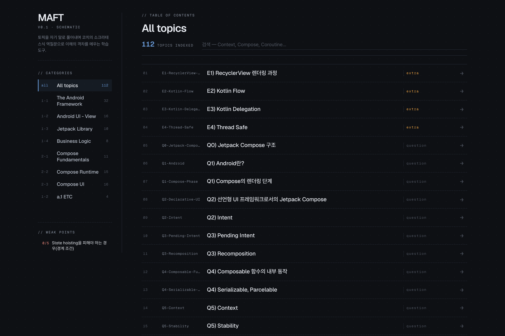
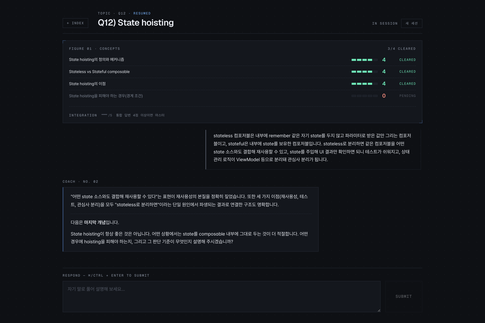
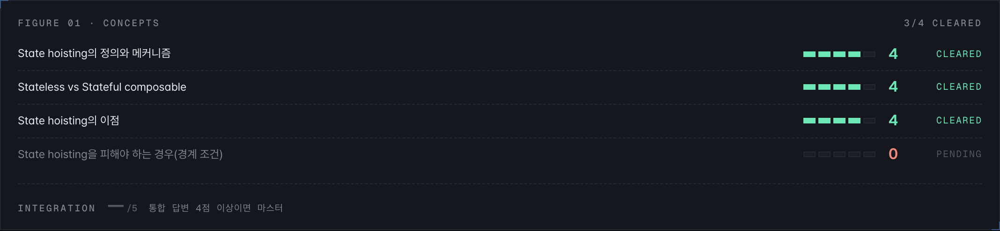
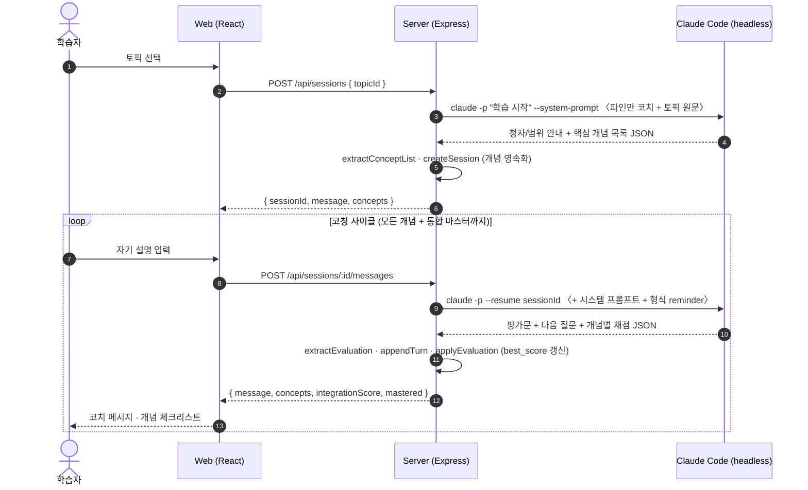
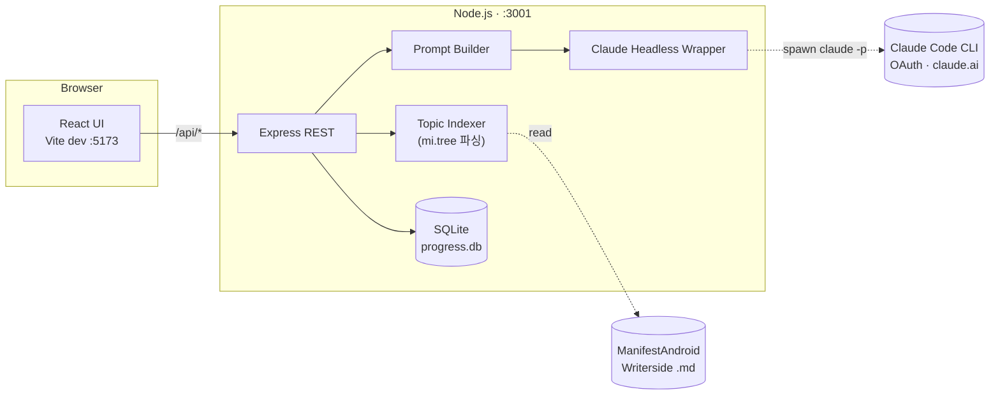
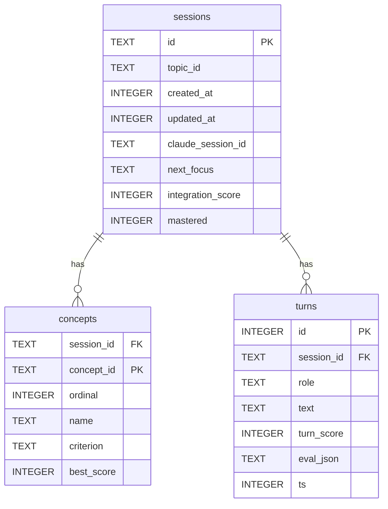

# Manifest Android Feynman Trainer

> 자기 말로 설명 → AI 코치의 평가 → 소크라테스식 역질문으로 빈틈을 메우는 **안드로이드 CS 학습 도구**.
> Claude Code headless 모드를 백엔드로 사용하므로 Claude.ai 구독 자격증명만으로 동작하며, 별도 API 과금이 없습니다.

> 약칭 **MAFT** (Manifest Android Feynman Trainer).

## 기획 의도

[skydoves/manifest-android-interview](https://github.com/skydoves/manifest-android-interview) 의 안드로이드 CS 토픽 약 109개를 그저 읽고 흘려보내는 대신,
**파인만 학습 기법**(자기 설명 → 평가 → 빈틈 역질문 → 재학습) 을 인터랙티브로 구현해 이해도가 일정 수준에 도달할 때까지 가르쳐 주는 학습 도구입니다.

학습자가 토픽을 자기 말로 풀어내면, AI 코치가 토픽 원문을 기준으로 채점하고 학습자가 빠뜨린 핵심 개념을 가리키는 역질문을 돌려줍니다.
토픽은 핵심 개념 3~5개로 분해되어 개념별 점수와 진척이 SQLite 에 영속화되므로, 어떤 개념을 얼마나 이해했는지가 체크리스트와 인덱스에 그대로 드러납니다.

## 화면

토픽 인덱스 (사이드바에 누적 약점)



학습 세션 — 개념 체크리스트와 코치의 소크라테스식 역질문



개념 체크리스트 — 개념별 0~5 점수 · 상태 뱃지 · 통합 점수



> 캡처는 `Q12-State-hoisting.md` 토픽을 진행하던 시점입니다.

## 학습 사이클



## 아키텍처



## 데이터 모델



채점 단위는 "턴"이 아니라 "개념"입니다. 매 평가 턴은 답변이 다룬 개념들의 `best_score` 를 끌어올리며(한 답변이 여러 개념을 동시에 갱신할 수 있음), 마스터(모든 개념 ≥3 + 통합 답변 ≥4)는 LLM 응답이 아니라 저장된 점수로 서버가 직접 판정합니다. 토픽별 진척률과 전역 약점(아직 3점 미만인 개념)은 `sessions`·`concepts` 위의 집계 쿼리로 도출합니다(별도 머터리얼라이즈 테이블 없음).

## 빠른 시작

사전 요구사항:

- **Node.js 20+**
- **[Claude Code CLI](https://docs.claude.com/claude-code)** 가 설치되어 있고 `claude.ai` 로그인이 완료되어 있어야 합니다
  (`claude auth status` 의 `authMethod` 가 `claude.ai` 여야 합니다)

```bash
git clone git@github.com:ckgod/maft.git
cd maft
./scripts/install.sh   # 의존성 점검 → Writerside 콘텐츠 clone → npm install
./scripts/dev-up.sh    # 두 dev 서버 백그라운드 시작 + 헬스체크
open http://localhost:5173
```

종료할 때:

```bash
./scripts/dev-down.sh  # 두 서버 종료
# 로그는 scripts/.run/server.log · scripts/.run/web.log 에 남습니다
```

`install.sh` 가 하는 일:

1. node / npm / git / claude CLI 가 PATH 에 있는지, Node 가 20+ 인지 확인
2. Claude OAuth 인증 상태(`authMethod: claude.ai`) 확인
3. `../ManifestAndroid` 가 없으면 [ckgod/ManifestAndroid](https://github.com/ckgod/ManifestAndroid) 를 얕게 clone (`MAFT_WRITERSIDE_REPO` / `MANIFEST_WRITERSIDE_DIR` 로 override 가능)
4. `server` · `web` 의존성 설치

> 한 터미널씩 직접 띄우고 싶다면 `cd server && npm run dev` / `cd web && npm run dev` 도 그대로 동작합니다.

환경 변수:

| 변수 | 기본값 | 설명 |
|---|---|---|
| `MANIFEST_WRITERSIDE_DIR` | `../../ManifestAndroid/Writerside` | 토픽 콘텐츠 루트 |
| `MAFT_DB_PATH` | `server/data/progress.db` | SQLite 진행 상황 DB |
| `PORT` | `3001` | 서버 포트 |
| `ANTHROPIC_API_KEY` | (미설정 권장) | 설정 시 OAuth 대신 API 키로 동작해 사용량 과금이 발생합니다. **MAFT 의 의도와 어긋나므로 unset 을 권장합니다** |

## 핵심 설계 결정

- **Claude Code headless 로 LLM 호출** — `claude -p` 서브프로세스를 spawn 하고 `--output-format json` 을 파싱합니다. `--bare` 옵션을 사용하지 않으면 OAuth(claude.ai 구독) 자격증명이 자동으로 적용되므로 별도 API 키 없이 구독 한도 내에서 동작합니다.
- **개념 단위 채점** — 토픽을 핵심 개념 3~5개로 분해하고, 학습 시작 시 코치가 개념 체크리스트를 JSON 으로 산출해 `concepts` 테이블에 영속화합니다. 이후 평가 턴마다 코치는 답변이 다룬 개념별 점수(`{scores, integration_score, next_focus, mastered}`)를 첨부하며, 한 답변이 여러 개념을 동시에 끌어올릴 수 있습니다. 키 변형 금지·형식 reminder 자동 첨부로 LLM 변동성을 흡수하고, 시작 시 개념 JSON 이 누락되면 1회 재시도합니다.
- **점수 인플레이션 방지** — 같은 답변을 살짝 바꿔 재제출해도 새 정보가 없으면 점수가 오르지 않도록 시스템 프롬프트에 일관성 규칙을 두었습니다 (`score 2 → 2` 동결을 PoC 에서 확인했습니다).
- **청자 재정의** — 일반적 파인만의 "12살 청자" 가정은 안드로이드 학습엔 부적합해 (Compose 가 무엇인지부터 풀어 설명할지 학습자가 혼란을 겪습니다), **"이 토픽은 처음 듣지만 4대 컴포넌트 · Compose Composable/State · Kotlin 기초는 아는 동료 개발자"** 로 재정의했습니다.
- **SQLite 영속화 + 개념별 진척 추적** — 세션·개념·turns 를 SQLite 에 영속화하고, 개념별 `best_score` 로 진척을 추적해 사이드바 Weak Points(3점 미만 개념)와 인덱스 진척률(`n/N 개념`)로 노출합니다.

## 디렉토리

```
.
├── server/                  Node.js + Express + TypeScript
│   ├── src/
│   │   ├── claude.ts        headless 래퍼 (claude -p spawn)
│   │   ├── topics.ts        mi.tree 정규식 파싱 · 토픽 인덱스
│   │   ├── prompt.ts        파인만 시스템 프롬프트 + 개념/채점 JSON 추출
│   │   ├── routes.ts        REST API
│   │   ├── sessions.ts      SQLite 세션 영속화
│   │   ├── stats.ts         토픽 통계 + Weak Points 집계
│   │   ├── db.ts            better-sqlite3 + 스키마 부트스트랩
│   │   ├── config.ts        Writerside 경로 해석
│   │   └── index.ts         부트스트랩
│   └── data/                progress.db (gitignore)
└── web/                     Vite + React + TypeScript
    └── src/
        ├── App.tsx          토픽 인덱스 + Weak Points 사이드바
        ├── SessionView.tsx  학습 세션 화면 (Coach / Response 엔트리)
        ├── ScorePanel.tsx   Figure 01 · 개념 체크리스트 (점수·상태·통합)
        ├── api.ts           REST 클라이언트
        ├── App.css          Schematic Dark — layout / 세션
        └── index.css        디자인 토큰 + 진입 애니메이션
```

## 디자인 톤

차분한 학습 환경을 의도해 **Schematic Dark** 톤으로 정리했습니다. Geist + Pretendard Variable, paper `#0e1014`, 강조색 blueprint `#6b9ddb`, 점수 팔레트 (moss / amber / sienna / slate) 로 구성되어 있습니다. 게임화는 인플레이션을 피하고자 차분한 배지 (`3/4 개념`, `★ mastered`) 와 개념별 0~5 점수 미터만으로 한정합니다.

## 한계 / 다음 단계

- **응답 스트리밍 미적용** — 첫 문자 도착까지 수 초가 걸립니다 (`--output-format stream-json` 으로 SSE 도입 예정입니다).
- **Weak Points 정규화는 단순 trim/lowercase** — "recomposition 트리거" / "리컴포지션 발생 조건" 이 별개 항목으로 누적될 수 있습니다.
- **테스트 미작성** — Phase 5 에서 핵심 경로(JSON 추출, 채점 일관성) 위주로 추가할 예정입니다.

## 라이선스 / 출처

학습 콘텐츠 원본 저작권은 [skydoves/manifest-android-interview](https://github.com/skydoves/manifest-android-interview) 에 있습니다 (Apache 2.0). 본 도구는 콘텐츠를 동봉하지 않고, 인접 디렉토리의 Writerside 파일을 읽어 사용합니다.
